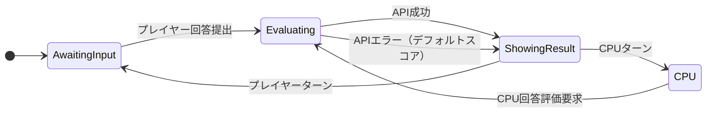

# 大喜利すごろくゲーム アーキテクチャ

Unity 側のプレゼンテーション/状態管理と Gemini API による評価ロジックを分離したレイヤー構成と設計方針を整理します。

```mermaid
flowchart TD
    subgraph UIレイヤー
        A[GameCanvas Scene]
        B[UI 表示・入力 (オーダー/スコア)]
    end
    subgraph GameLogic
        C[GameManager]
        D[State Machine]
        E[Turn/Score Manager]
    end
    subgraph Evaluation
        F[OgiriEvaluator]
        G[GeminiAPIManager]
        H[JSON パーサ]
    end
    subgraph Data
        I[お題リスト (ScriptableObject/JSON)]
        J[CPU回答パターン / 履歴]
    end

    A --> B
    B --> C
    C --> D
    C --> E
    C --> I
    C --> J
    C --> F
    F --> G
    G --> H

    click G "https://cloud.google.com/generative-ai"
```

## レイヤー詳細

- **UI Layer**: GameCanvas シーンは背景やサイコロ、キャラクター、スコアなどの描画と、タップ/クリックの入力受付に特化。UI 側でゲームロジックを扱わず、描画/操作に専念しながら GameManager に信号を送る。
- **GameLogic**: GameManager がお題提示、回答受付、Gemini 評価呼び出し、得点比較を制御。`GameState`（`AwaitingInput → Evaluating → ShowingResult → CPU`）に応じて State Machine で処理を切り替える。Turn/Score Manager がターンの判定と累積スコアを保持し、評価結果を受けて得点を更新。CPU モードは `IEvaluator` を介してモック評価器に差し替えられるようにし、テスト性とオフライン実行を支援する。
- **Evaluation**: OgiriEvaluator は「辛口放送作家」プロンプトを構築し、ユーザーのトピック＋回答を GeminiAPIManager に渡す。GeminiAPIManager は `UnityWebRequest` + `async/await` で `gemini-1.5-pro` をまず叩き、レート制限などで失敗したら `gemini-1.5-flash` へフォールバック。リクエストでは `responseMimeType: "application/json"` を指定し、返却 JSON は Newtonsoft/JsonUtility で `candidates[0].content.parts[0].text` を抽出して `score/comment` の DTO に変換。パース失敗時にはデフォルト結果を返すことでゲーム側の安定性を保つ。
- **Data**: お題リストや CPU 回答パターン、履歴などは ScriptableObject または JSON（`TopicDataStore` や `data/topics.json`）で外部化。GameManager は `TopicRepository`/`TopicDataStore` を参照してカテゴリ・難易度・ランダム性を制御し、カスタムモードの切り替えにも対応できる。

## 設計思想と依存性

- **分離と逆転**: UI と評価ロジックを分け、GameManager は `IEvaluator` 抽象を使って Gemeni 本番実装・CPU 実装・モックを容易に差し替えられるようにする。
- **テスト機構**: `[ContextMenu]` などの Inspector テスト機能で「プレイヤー/CPU お題 + 回答」を入力すると評価結果をログ出力し、GameState やスコア更新を確認できる仕組みを用意。
- **拡張性**: State Machine とターン/スコアマネージャの境界を明確にし、将来キャラクター移動やリアルタイム対戦、ネットワーク同期、ステート復元を追加する際も分離された責務を維持できるようにする。

## 状態遷移



- **AwaitingInput**: UI から回答を受け取り、OgiriEvaluator へ渡す準備をする。
- **Evaluating**: GeminiAPIManager を呼び出して `score/comment` を取得。成功と失敗（デフォルト）で ShowingResult に移行。
- **ShowingResult**: スコアとコメントを UI に反映し、次に動く対象（人間 or CPU）を判断。
- **CPU**: CPU の回答生成を完了したら Evaluating に戻り、必要であればログやタイマーも併せて処理。

## TopicRepository と ScriptableObject

- `Topic` DTO は `Id`/`Category`/`Prompt`/`Difficulty` を持ち、`TopicDifficulty`（`Easy`/`Normal`/`Hard`）で UI フィルタを提供。
- `TopicRepository` は JSON や `TopicDataStore` から `Topic[]` を読み込み、`GetTopics(category, difficulty)` や `GetRandomTopic(...)` を提供。`StreamingAssets` 上の `topics.json` や `Resources/TextAsset` 経由でロードできるようにし、カテゴリ/難易度の制御を GameManager から容易にする。
- `TopicDataStore`（ScriptableObject）を複数用意することでイベントやレベル別のトピックを切り替え可能。デザイナーは Inspector で `Category`・`Difficulty`・`Prompt` を直接編集して新セットを作成できる。
- GameManager は `OgiriEvaluator` を `[SerializeField]` で受け取り、UI からの回答を `EvaluateCurrentAnswerAsync(answer)` で評価し、`EvaluationResult` をスコア更新と `ShowingResult` に使用する。Gemini API キーは `GeminiAPIManager` アセットで管理し、Inspector から割り当てる。

## IEvaluator 抽象

- **契約**: `Task<EvaluationResult> EvaluateAsync(string topic, string answer, CancellationToken cancellationToken = default)`。`topic` は `Topic.Prompt`、`answer` はプレイヤー/CPU の回答。
- **用途**: GameManager は `await evaluator.EvaluateAsync(currentTopic, playerAnswer)` を呼び、スコアとコメントから状態遷移と得点処理を行う。
- **実装の切り替え**: 本番（OgiriEvaluator + GeminiAPIManager）では Gemini を呼んで JSON をパースし、モック/CPU では固定スコア・ランダム値の `MockEvaluator` を差し替えて Gemini 呼び出しなしで動作確認が可能。
- **設定**: Inspector/DI により `IEvaluator` を切り替えられる構成とし、Gemini 本番・CPU・モックを用途に応じて使い分ける。

## 補足

- 必要に応じてこの構成をもとにクラス図やシーケンス図などを追加し、他のチームメンバーとも設計を共有してください。
