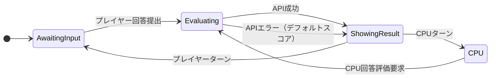

# 設計思想

## レイヤー構成
- **UI Layer**: GameCanvas の描画・入力のみを担当し、ゲームロジックとの側面は GameManager に委譲。UI は状態や評価を知らずに描画/操作に集中する。
- **Game Logic**: `GameManager` が全体進行を制御し、状態遷移（例: `AwaitingInput` → `Evaluating` → `ShowingResult` → `CPU`）とターン/スコアのマネージャを組み合わせて得点処理を進める。
- **Evaluation**: `OgiriEvaluator` が「辛口放送作家」プロンプト + お題/回答を構築し、`GeminiAPIManager` に委ねて `gemini-1.5-flash` 評価を得る。JSON パーサ（Newtonsoft.Json やカスタム JsonUtility ラッパー）で `candidates[0].content.parts[0].text` を解析し、`score/comment` に変換。
- **Data**: お題リストや CPU 回答パターン、履歴などは ScriptableObject または JSON で外部化し、GameManager による参照と柔軟な調整・拡張を可能にする。

## 依存性とテスト性
- `GameManager` は `IEvaluator` 抽象を受け取り、Gemini 本番評価・CPU モード・モックの差し替えを容易にすることでテストとオフライン開発を支える。
- 評価パイプラインは `IEvaluator` → `OgiriEvaluator` → `GeminiAPIManager` → `JSON パーサ` という下流への依存で構成し、API 層に状態や UI の責務を持ち込まない。

## 拡張/運用のための配慮
- エラーハンドリング（API キーの無効・ネットワーク障害など）を `GeminiAPIManager` 内で完結させ、GameManager ではデフォルト値や再試行判断に集中させる。
- Inspector 上のテスト（入力 + 実行ボタン）で `GameManager` から `OgiriEvaluator` を呼び出しログ出力する仕組みを用意し、ステート遷移とスコア更新を定期的に確認できるようにする。
- State Machine とターン/スコアマネージャの境界を明確にして、CPU との交互ターンやリアルタイム対戦への拡張時にステート復元やネットワーク同期を追加しやすくする。

## 次に整備すべき資料
1. 状態遷移図: `GameManager` のステート間の流れ、それぞれの入力と出力のタイミングを整理する。
2. `IEvaluator` インターフェース定義: 本番・モックの使い分けと注入パターンを明文化。
3. データスキーマ: お題ファイル・CPU パターン・履歴のフォーマットと読み込みタイミング。

# 状態遷移図

各状態では以下の情報を押さえる:
- `AwaitingInput`: UI から回答を受け取るトリガーと、回答データを `OgiriEvaluator` へ渡す準備。
- `Evaluating`: `GeminiAPIManager` を呼び出し、`score/comment` を受け取ったら `ShowingResult`、失敗なら `HandleError` 経由で結果画面に退避。
- `ShowingResult`: スコアとコメントを UI に反映し、次ターンの対象（人間/CPU）を識別。
- `CPU`: CPU回答を生成し終えたところで `Evaluating` に戻る。必要に応じてタイマーやログも出力。

この図と説明を `DESIGN_PHILOSOPHY.md` に残しておけば、状態の責務、トリガー、想定される入出力が共有され、実装・検証・拡張のベースになります。

## TopicRepository と ScriptableObject

- `Topic` データは `Topic.cs` に `id`/`category`/`prompt`/`difficulty` を持つ DTO として定義しており、 `TopicDifficulty` による `Easy`/`Normal`/`Hard` の三段階で UI や GameManager が絞り込み可能です。
- `TopicRepository`（`TopicRepository.cs`）は JSON または `TopicDataStore` から `Topic[]` をロードし、 `GetTopics(category, difficulty)` / `GetRandomTopic(...)` を提供。StreamingAssets に置いた `topics.json` を `LoadFromStreamingAssets("topics.json")` で読み込んだり、 `Resources/TextAsset` を介してロードできるようにしています。
- Unity 上で手動管理したい場合は `TopicDataStore`（ScriptableObject）に `topics` を格納し `ToRepository()` で `TopicRepository` に変換。インスペクタでカテゴリや難易度を調整すればローカル編集も OK です。
- JSON 形式については `data/topics.json` を例として保持しており、 `category` フィールドで UI や画面ボタンを切り替え、 `difficulty` フィールドを追加すれば難易度フィルタを活用できます。将来的にカテゴリごとの重みづけ（例：Easy を多めに出す）もこのリポジトリ層で制御可能です。

この設計を使えば、 Gemeni 評価前の「お題選択ロジック」と「評価ロジック」をクリーンに分離し、画面ごとの表示や CPU へのお題引き当ても柔軟に設定できます。
